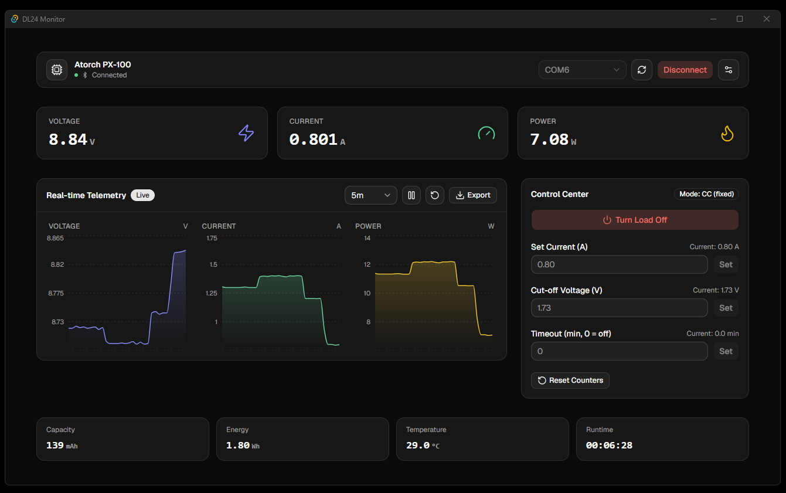
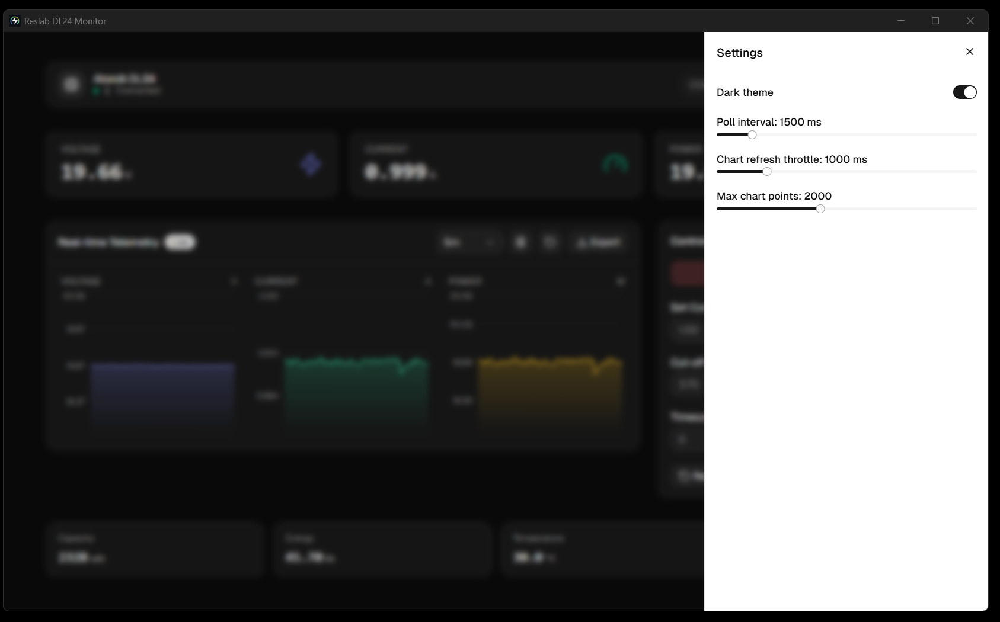
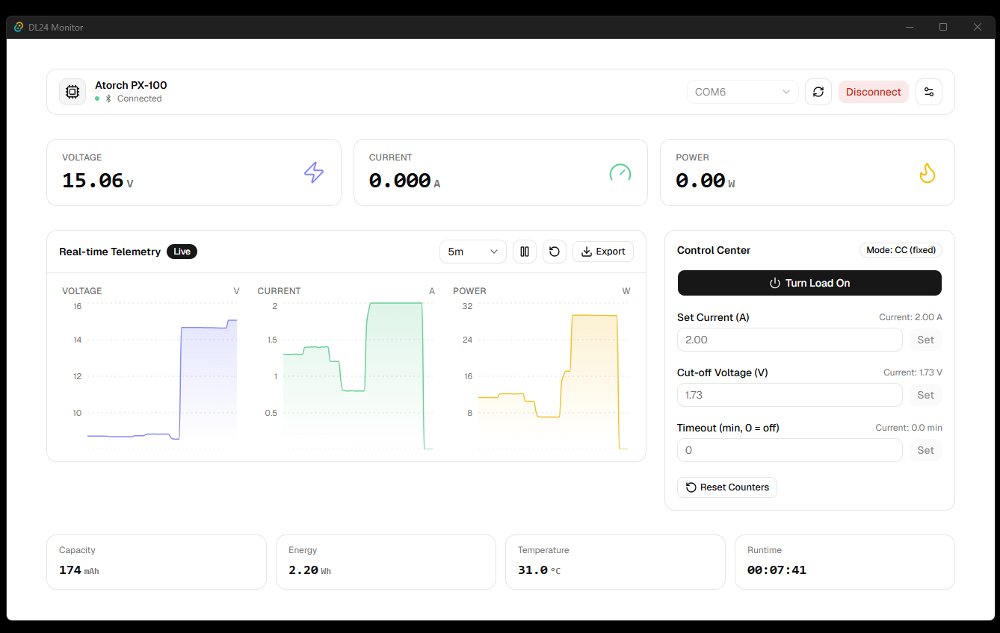
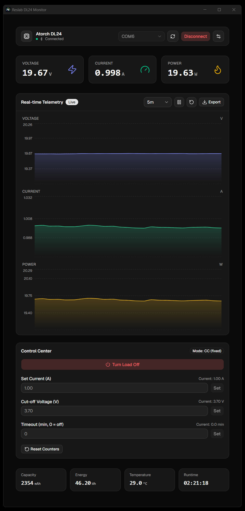

# Reslab DL24 Monitor

[](https://github.com/andrewchuev/reslab-dl24-monitor/releases/latest)

A desktop instrument panel for the **Atorch DL24 / PX-100** USB electronic DC
load: real-time voltage/current/power telemetry, capacity/energy/temperature/
runtime metrics, CSV session export, and a Control Center for driving the
load directly — set current, cut-off voltage, timeout, on/off, and counter
reset.

## Screenshots

| Live telemetry | Settings | Light theme | Compact layout |
| --- | --- | --- | --- |
|  |  |  |  |

## Features

- Automatic port detection: remembers the last port that worked and tries
  it first; otherwise (or if it's gone) probes every available port from
  the highest number down, since the DL24 typically enumerates as the
  last or second-to-last serial port on the system
- Real-time voltage / current / power, each on its own auto-scaled chart
  with a real elapsed-time axis and full-session history (the "30s/5m/15m"
  range only zooms the live view; "All" and CSV export always cover the
  whole session, not just what's currently rendered)
- Capacity (Ah), energy (Wh), temperature and runtime readouts
- CSV export of a monitoring session, full precision, unbounded by the
  chart's render settings
- Excel (.xlsx) export with the same full-precision data plus native,
  editable voltage/current/power charts on their own sheet
- Control Center: load on/off, set current, set cut-off voltage, set
  timeout, reset accumulated counters
- Dark/light theme, configurable poll interval and chart history
- UI in English, Russian or Ukrainian (Settings → Language), detected from
  the OS locale on first launch with English as the fallback; measurement
  units (V/A/W/Ah/Wh) and numeric formatting stay locale-neutral throughout
  the UI, charts and exports for consistency and easier data interchange
- Type-safe Rust ↔ TypeScript bridge — the UI never drifts from the backend

**Note:** the PX-100 only operates in fixed constant-current (CC) mode —
there is no mode-switch command in the protocol, so the Control Center shows
a static "Mode: CC" badge rather than a CC/CV/CR/CP selector.

## Tech Stack

- **Backend:** Rust, [Tauri v2](https://v2.tauri.app/), [`serialport`](https://crates.io/crates/serialport), [`tauri-specta`](https://github.com/specta-rs/tauri-specta), [`rust_xlsxwriter`](https://crates.io/crates/rust_xlsxwriter)
- **Frontend:** React 19, TypeScript, [shadcn/ui](https://ui.shadcn.com/) (Radix + Tailwind v4), [Recharts](https://recharts.org/), [react-i18next](https://react.i18next.com/)
- **Release automation:** GitHub Actions, [`tauri-action`](https://github.com/tauri-apps/tauri-action) (Windows/macOS/Linux installers)

## Protocol

The PX-100 exposes a binary command protocol over a 9600 8N1 UART link
(USB-serial or Bluetooth-serial bridge). Every exchange is host-initiated:
the app sends a 6-byte request frame and the device replies with either a
1-byte acknowledgement (write commands) or a 7-byte data frame (queries).

**Request frame**

| Offset | 0 | 1 | 2 | 3 | 4 | 5 |
| --- | --- | --- | --- | --- | --- | --- |
| Value | `0xB1` | `0xB2` | command | data1 | data2 | `0xB6` |

**Query response frame** (commands ≥ `0x10`)

| Offset | 0 | 1 | 2 | 3 | 4 | 5 | 6 |
| --- | --- | --- | --- | --- | --- | --- | --- |
| Value | `0xCA` | `0xCB` | data1 | data2 | data3 | `0xCE` | `0xCF` |

**Write acknowledgement** (commands < `0x10`): a single `0x6F` byte.

### Write commands

| Code | Command | data1 | data2 | Effect |
| --- | --- | --- | --- | --- |
| `0x01` | On/off | `1` = on, `0` = off | `0` | Enables or disables the load |
| `0x02` | Set current | integer amps | fractional amps × 100 | Sets the CC current, e.g. 2.50 A → `(2, 50)` |
| `0x03` | Set cut-off voltage | integer volts | fractional volts × 100 | Under-voltage protection threshold |
| `0x04` | Set timeout | seconds (high byte) | seconds (low byte) | Auto-off timer as a 16-bit value; `0` disables it |
| `0x05` | Reset counters | `0` | `0` | Clears the accumulated capacity/energy counters |

### Query commands

data1..data3 form a 24-bit big-endian integer that is divided by the scale
factor below to get the physical value, except the two time fields, which
are the `HH`, `MM`, `SS` bytes directly.

| Code | Command | Scale | Unit |
| --- | --- | --- | --- |
| `0x10` | Load on/off state | ÷ 1 | `0`/`1` |
| `0x11` | Measured voltage | ÷ 1000 | V |
| `0x12` | Measured current | ÷ 1000 | A |
| `0x13` | Elapsed time | — | `HH:MM:SS` |
| `0x14` | Capacity | ÷ 1000 | Ah |
| `0x15` | Energy | ÷ 1000 | Wh |
| `0x16` | Temperature | ÷ 1 | °C |
| `0x17` | Set current (readback) | ÷ 100 | A |
| `0x18` | Set cut-off voltage (readback) | ÷ 100 | V |
| `0x19` | Set timeout (readback) | — | `HH:MM:SS` |

### Polling and reliability

- `0x10`–`0x14` are queried every poll cycle; `0x15`–`0x19` are queried
  round-robin, one per cycle, to keep each cycle short.
- Every query/write is retried up to 3 times with a ~1.2 s response deadline
  and a ~200 ms backoff between attempts.
- Reads and writes watch a shared stop flag, so disconnecting doesn't have
  to wait out an in-flight timeout.
- If 5 consecutive poll cycles read nothing at all (e.g. the USB-serial
  adapter was unplugged), the app auto-reconnects: it reopens the port and
  re-probes it, up to 5 attempts with a 2 s backoff. Success resumes polling
  transparently; exhausting all attempts reports a connection error and
  stops, instead of the UI silently freezing on stale readings.

Reverse-engineered from the [`misdoro/Electronic_load_px100`](https://github.com/misdoro/Electronic_load_px100)
protocol notes; see `dl24_reference.py` for the original Python reference
implementation this app's Rust protocol layer is ported from.

## Logs

Every launch writes a fresh `session-YYYYMMDD-HHMMSS.log` (UTC) to the app's
log directory - decoded telemetry per poll cycle, every serial retry/failure,
and every user action (connect/disconnect, Control Center commands, chart
controls, settings changes), so a session can be replayed after the fact
instead of only reasoning from what's currently on screen.

| OS | Location |
| --- | --- |
| Windows | `%LOCALAPPDATA%\dev.reslab.dl24monitor\logs\` |
| macOS | `~/Library/Logs/dev.reslab.dl24monitor/` |
| Linux | `~/.local/share/dev.reslab.dl24monitor/logs/` |

## Getting Started

### Prerequisites

- [Rust](https://www.rust-lang.org/tools/install)
- [Node.js](https://nodejs.org/)
- Platform build tools per the [Tauri prerequisites guide](https://v2.tauri.app/start/prerequisites/)

### Development

```sh
npm install
npm run tauri dev
```

### Adding translations

UI strings live in `src/i18n/locales/{en,ru,uk}.json`, one flat-ish key tree
shared across all three - add a key to all three files when adding new UI
text (`en.json` is the reference). Rust-originated error messages are only
partially localized: `src/utils/backendErrors.ts` maps the fixed set of known
backend error strings to translation keys and falls back to the raw English
text for anything else (e.g. OS-level I/O errors), since the backend doesn't
send error codes.

### Build

```sh
npm run tauri build
```

The frontend bundle is ~760 kB minified (~230 kB gzip), mostly `recharts` and
its Redux-based internals - well past Vite's default 500 kB chunk-size
warning, which is raised in `vite.config.ts` since that threshold targets
assets fetched over a network, not a Tauri bundle loaded from disk.

### Testing

```sh
cd src-tauri && cargo test    # protocol parsing + mocked serial framing
cd src-tauri && cargo clippy  # Rust lints
npx tsc --noEmit              # frontend type-checking
```

## Releasing

The app version lives in `package.json`; `src-tauri/tauri.conf.json` points at
it directly and `src-tauri/Cargo.toml` is kept in sync automatically by
`scripts/sync-version.cjs`, which runs as npm's `version` lifecycle script:

```sh
npm version patch   # or minor / major
git push origin main --follow-tags
```

To cut a release, push that commit to the `release` branch:

```sh
git push origin main:release
```

`.github/workflows/release.yml` then builds installers for Windows, macOS
(Intel + Apple Silicon) and Linux and publishes them as a GitHub Release
tagged `app-v<version>` — no pull request involved.
